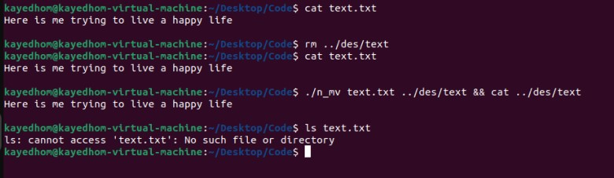
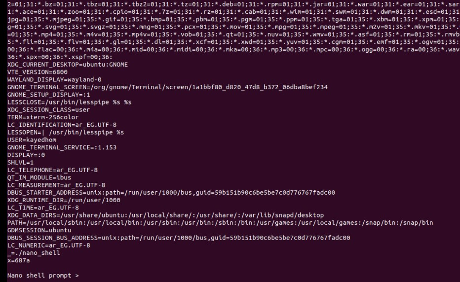

# ptrace-the-kernel

## About This Project

This repository contains simple implementations of standard Unix utilities (like `mv`, `pwd`, `echo`, `FemtoShell`, `PicoShell`, `NanoShell`, `MicroShell` etc.) that I've created as part of my learning journey with Unix/Linux system programming.

## Learning Goals

The main purpose of this project is to understand how system calls work at a low level. Each program demonstrates:

- Direct use of system calls (open, read, write, unlink, getcwd, etc.)
- Proper error checking mechanisms for system calls
- Simulate a real shell using demo shell (Nano, Micro shell)
- How standard Unix utilities can be implemented using these fundamental building blocks

## Implementation Philosophy

All programs follow a consistent pattern:
1. Call the necessary system functions directly
2. Check return values to detect errors
3. Useing stdio, errnos to display meaningful error messages when issues occur
4. Clean up resources properly regardless of success or failure

## Programs Included

- **filecopy**: A basic implementation of copy functionality

- **filemove**: Implementation of move functionality

- **pwd**: Displays the current working directory
- **echo**: Echoes command line arguments to stdout

- **NanoShell**: demo shell that simulate a simple shell

- and more soon

## Learning Resources

These programs were created while learning from various resources on Unix system programming, including:
- "SPL01 System Programming in Linux", Udemy course, by Mr. Reda Maher 
- "The Linux Programming Interface" by Michael Kerrisk
- Linux man pages for system calls